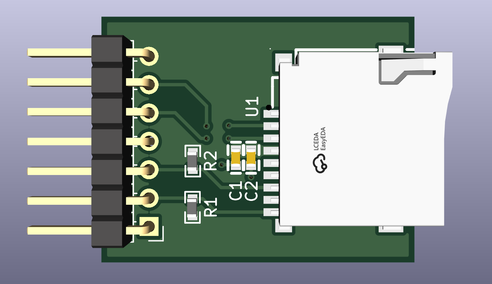
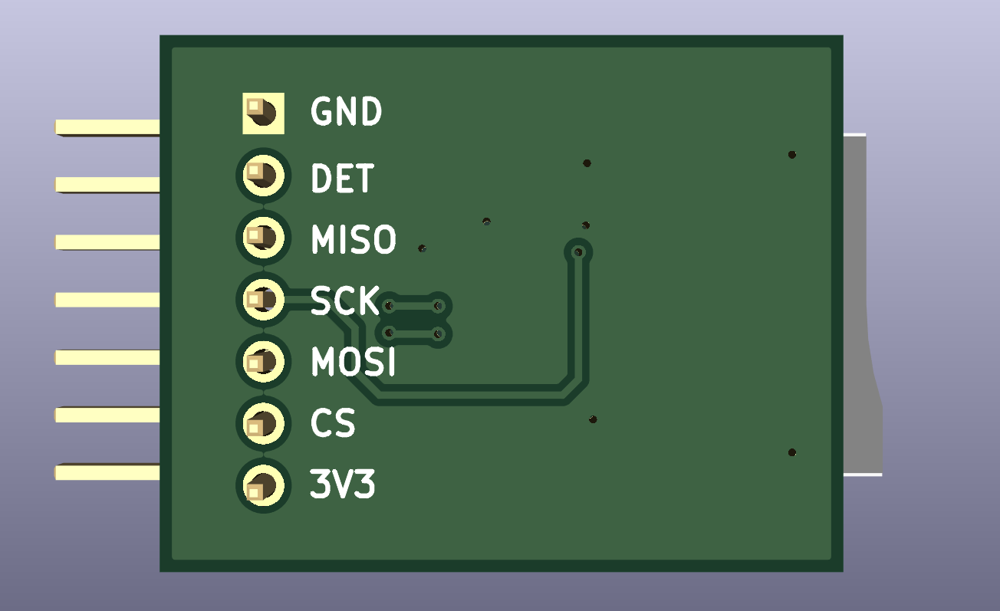
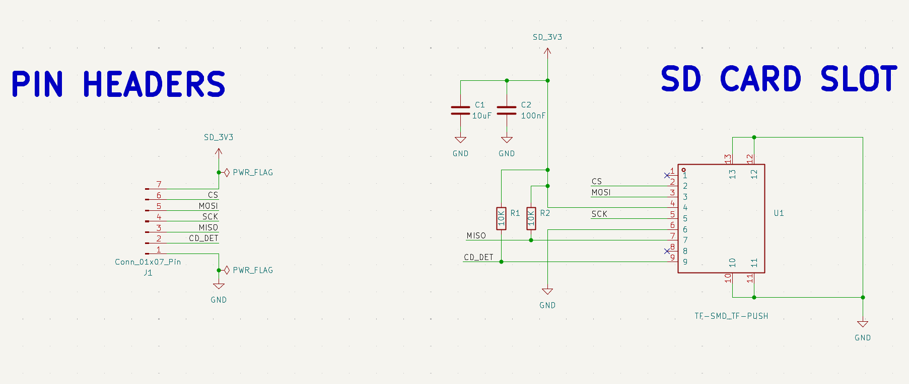
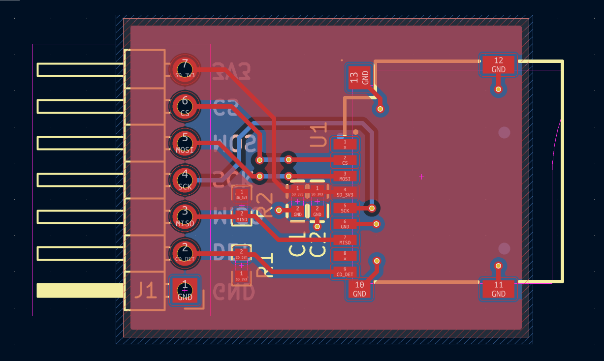

# 3.3V MicroSD Card SPI Breakout Board

A compact, high-performance, 2-layer **MicroSD Card Breakout Board** designed in KiCad for embedded microcontrollers using the **SPI (Serial Peripheral Interface)** bus.

Designed specifically for 3.3V native logic ecosystems (STM32, ESP32, RP2040, SAMD, Nordic, etc.), this module provides clean power decoupling, signal pull-ups, and a low-EMI ground plane layout.

---

## Board Renders

| Top View | Bottom View |
| :---: | :---: |
|  |  |

---

## Key Features

* **Native 3.3V Operation:** Designed without slow active/passive level shifters, maximizing SPI bus speeds (up to 25 MHz) with zero signal propagation delay.
* **Transient Power Decoupling:** Dedicated 10 uF bulk ceramic cap (C1) and 100 nF high-frequency ceramic cap (C2) positioned directly adjacent to the SD socket's VDD pin (Pin 4) to handle flash memory write current spikes (up to 200 mA).
* **Bus Stability:** Integrated 10k Ohm pull-up resistors on signal lines to prevent floating inputs and accidental bus writes during microcontroller startup/reset.
* **Card Detection:** Mechanically broken-out Card Detect (CD_DET) line to trigger hardware interrupts on card insertion/removal.
* **Optimized 2-Layer Signal Integrity:** Signal routing optimized for continuous return paths over an unbroken bottom Ground plane, minimizing EMI and clock ringing.
* **Standard 2.54mm Header:** 1x7 pin header footprint for breadboard prototyping or jumper wiring.

---

## Schematic & Layout

### Schematic

### PCB Layout

---

## Bill of Materials (BOM)

| Reference | Quantity | Value / Part | Footprint / Package | Description |
| :--- | :---: | :--- | :--- | :--- |
| **U1** | 1 | `TF_SMD_TF-PUSH` | MicroSD Push-Push Connector | Surface Mount TF/MicroSD Socket |
| **J1** | 1 | `Conn_01x07_Pin` | PinHeader 1x07, P2.54mm, Vertical | 0.1 inch Pitch Male Pin Header |
| **C1** | 1 | 10 uF | Ceramic Cap, 0805 | Bulk Power Decoupling |
| **C2** | 1 | 100 nF | Ceramic Cap, 0603 | High-Frequency Decoupling |
| **R1, R2** | 2 | 10k Ohm | Resistor, 0603 | Signal Pull-Up Resistors |

---

## Software Integration & Bring-Up Guide

### 1. SPI Clock Speed Stages
When writing software/drivers for SD cards via SPI:
1. **Initialization Phase (100 kHz - 400 kHz):** The SD Card specification requires initial setup (`CMD0`, `CMD8`, `ACMD41`) to be executed at a slow clock speed (<400 kHz) while the card initializes its internal state machine into SPI mode.
2. **Operational Phase (10 MHz - 25 MHz):** Once initialized into SPI mode, increase your MCU's SPI peripheral clock frequency up to **20-25 MHz** for high-throughput block read/write transfers.

### 2. Microcontroller Compatibility Notice
* **Native 3.3V MCUs (STM32, ESP32, RP2040, SAMD):** Connect directly to header pins.
* **5V MCUs (e.g., Classic Arduino Uno R3):** Require external active level shifters (like 74LVC125A) on `SCK`, `MOSI`, and `CS` lines to prevent over-voltage damage to the SD card.

---
